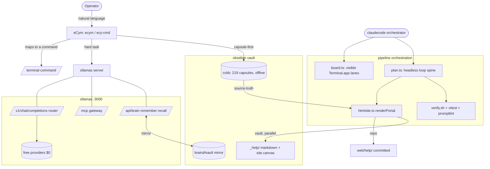

# Architecture — eCym · ollamas · obsidian · claudecode

> The $0, fully-local, four-system platform on one macOS (Apple Silicon) machine. Every claim here
> points at a real path in the tree. Backlog: `pipeline/ECYE2EMASTERPLAN.en.md` · runbook:
> `pipeline/SUSTAINABILITY.md`.

## The four systems

| System | Role | Lives at | Entry points |
|---|---|---|---|
| **eCym** | Natural-language → command model ($0 local) | `~/.local/bin/ecy*`, `~/ecy-model/` | `ecym`, `ecy-cmd`, `ecy-brain`, `terminal-dataset.json` |
| **ollamas** | Mission-control: LLM router + MCP gateway + pipeline | `~/Desktop/ollamas/` | `server/` (:3000), `cli/index.ts`, `pipeline/bin/*` |
| **obsidian** | Durable memory + knowledge + published docs | `~/ollamas-vault/` | `_bin/cckb`, `_help/`, brain⇄vault mirror |
| **claudecode** | Orchestrator: decides, builds, gates, commits | this repo + `.claude/` | `pipeline/bin/board.ts`, `pipeline/bin/plan.ts` |

## Data flow

## Key contracts
- **Two parallel targets** — every help artifact renders to `web/help/` (repo, committed) **and**
  `~/ollamas-vault/_help/` (vault) via `pipeline/bin/help-site.ts --vault`.
- **Source-truth / MISS ≠ PASS** — content is derived from real sources (`cckb`, `terminal-dataset.json`,
  `README.md`, `docs/obsidian/`); gates block on any missing measurement/section/link.
- **Prompt-fiction gate** — `pipeline/bin/promptlint.ts` fails any prompt naming an unreachable path
  (`pipeline/verify.sh` block 24).
- **Autonomous council** — claudecode/ollamas/eCym/obsidian pick the next ROI item by consensus and
  execute without asking; only outward-facing actions / irreversible deletes / `com.ecy*` pause.

## Boundaries
- The repo pushes to `fork` (`git@github.com:eCy-coding/ollamas.git`), branch `feat/claudecode-vault`.
- The vault is **local-only** (no remote); protected by git + tar backups + a `_sandbox/`-only deletion barrier.
- Emre's `com.ecy*` launchd jobs are never touched.
