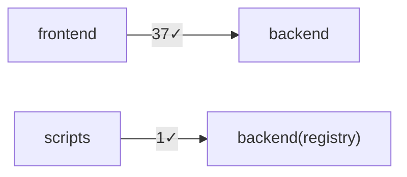

# DEPGRAPH — Cross-Lane Bağımlılık + API Gap

> READ-ONLY `depgraph.ts` üretti. Backend route: 67 · Frontend çağrı: 37 · Script kayıt: 1.
> Eşleşen: 37 · **MISSING: 0** · UNUSED: 15.

## MISSING (frontend → backend gap; yüksek öncelik)
_MISSING yok — tüm frontend çağrıları backend route'una eşleşti._

## UNUSED (çağrılmayan backend route)
- `/api/ready` (hiç çağrılmıyor — dead route olabilir; → backend: doğrula/kaldır)
- `/api/openapi.json` (hiç çağrılmıyor — dead route olabilir; → backend: doğrula/kaldır)
- `/api/generate` (hiç çağrılmıyor — dead route olabilir; → backend: doğrula/kaldır)
- `/api/macos-terminal` (hiç çağrılmıyor — dead route olabilir; → backend: doğrula/kaldır)
- `/api/cluster/status` (hiç çağrılmıyor — dead route olabilir; → backend: doğrula/kaldır)
- `/api/saas/upstreams/*` (hiç çağrılmıyor — dead route olabilir; → backend: doğrula/kaldır)
- `/api/saas/self/keys` (hiç çağrılmıyor — dead route olabilir; → backend: doğrula/kaldır)
- `/api/saas/self/keys/*/revoke` (hiç çağrılmıyor — dead route olabilir; → backend: doğrula/kaldır)
- `/api/saas/usage` (hiç çağrılmıyor — dead route olabilir; → backend: doğrula/kaldır)
- `/api/billing/run` (hiç çağrılmıyor — dead route olabilir; → backend: doğrula/kaldır)
- `/api/billing/webhook` (hiç çağrılmıyor — dead route olabilir; → backend: doğrula/kaldır)
- `/api/billing/checkout` (hiç çağrılmıyor — dead route olabilir; → backend: doğrula/kaldır)
- `/api/cluster/config` (hiç çağrılmıyor — dead route olabilir; → backend: doğrula/kaldır)
- `/api/cluster/consent` (hiç çağrılmıyor — dead route olabilir; → backend: doğrula/kaldır)
- `/api/cluster/leave` (hiç çağrılmıyor — dead route olabilir; → backend: doğrula/kaldır)

## Lane-kontrat grafiği (Mermaid)

## Cross-Package Version Drift (0 drifted / 8 lane)
> Aynı bağımlılık lane'ler arası farklı versiyona pinli mi (syncpack single-version-policy). Salt-string eşitlik (RISK-ORCH-011).

_✅ version-drift yok — tüm paylaşılan bağımlılıklar lane'ler arası tek versiyonda._

---
_Gap'leri bu sekme fixlemez — sahibi lane sekmesine backlog (§3)._
